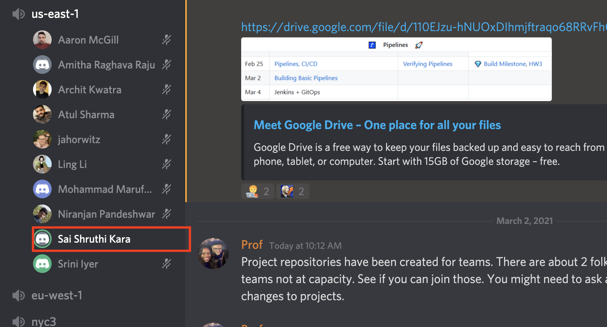
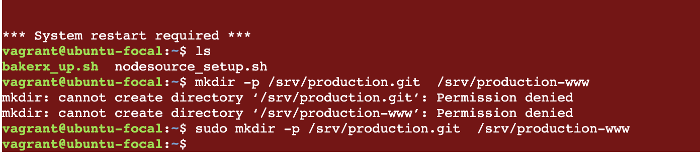
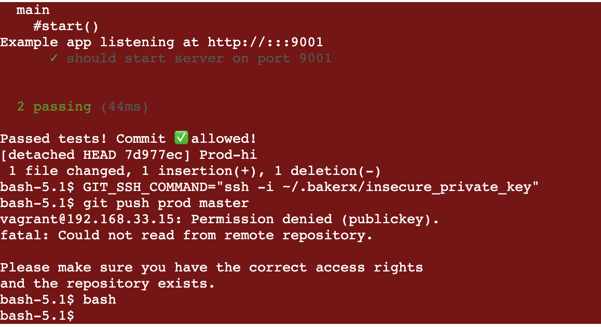
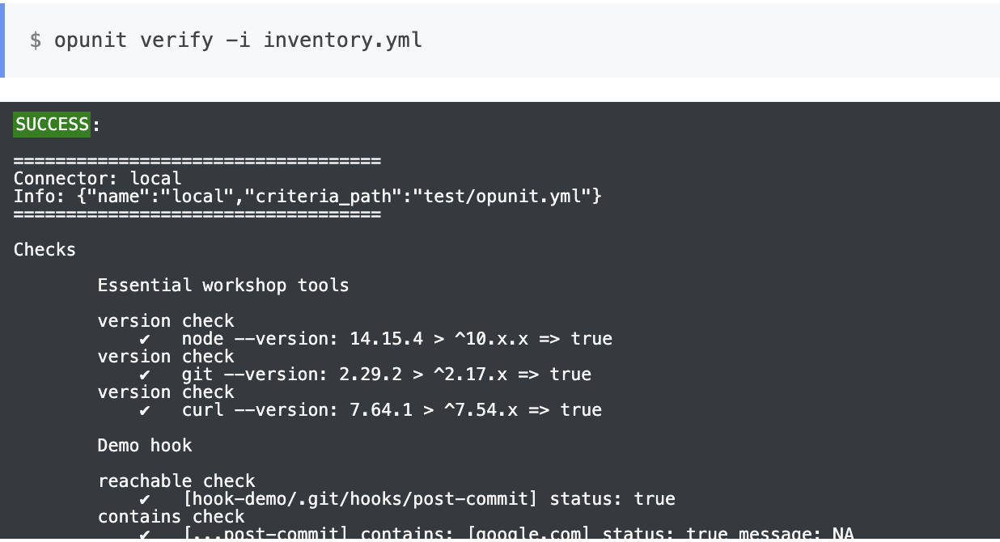
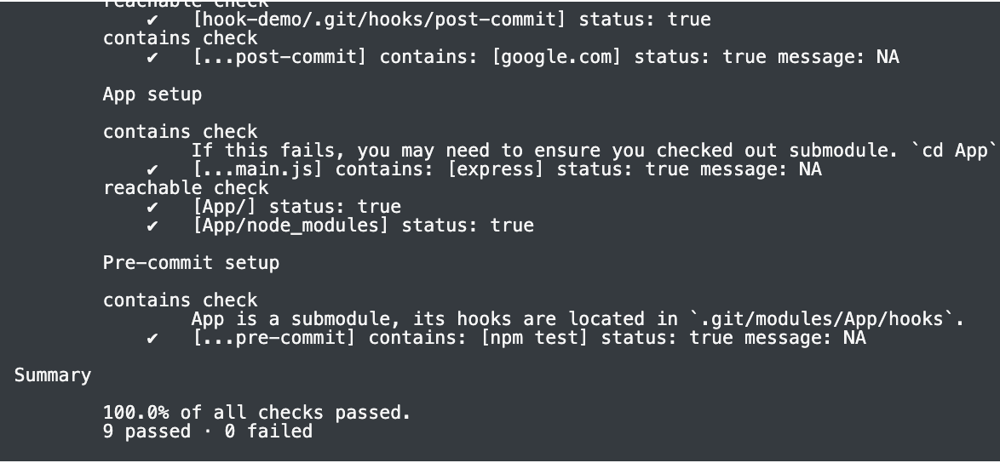
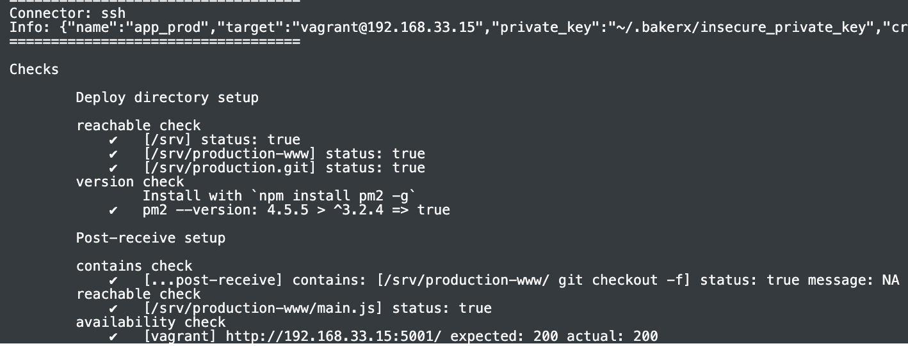
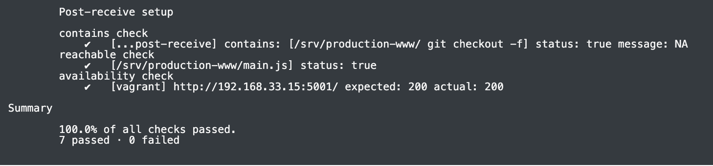

# HW3---Pipelines

## Class discussion (20) 
  
I have joined the "us-east-1" Discord voice channel for the discussion on experiences with CI on March 2nd,2021 at 8p.m. 
We have discussed about the positive and negative experiences with Continuous Integration.  
<ins>Positive Experience I shared:</ins> 
I was introduced to CI through the open source project I was working at NCSU. Travis CI was used in that project. There was a change with the UI we were trying to make. It was very important to make sure that nothing breaks as it is used by students to submit projects. The moment we checked in the commit was accessed and that really gave a lot of confidence that the existing code did not break. I could see the logs and metrics and access the performance change after my code changes etc.    
<ins>Negative Experience someone shared:</ins> 
When they committed the code changes, the build broke and the root cause was the memory outage issue. But, due to the minimal log support they were not able to figure out this and trying to make changes elsewhere which created latency and they had to push the deadline.
 
 

## Conceptual Questions Lecture (48)

**1. Why is a pipeline useful architecture for supporting continuous deployment?** 
Ans.) Through Pipelines we can achieve the series of transformations to be executed on the same input data. The pipelines consists of two parts namely, the pipe which is more of a message queue and the filter, which takes the incoming data drom one pipe and processes it and push it to the output pipe. 
This architectural style of pipelines is very useful in supporting the continuous deployment because: 
<ul>
  <li>It will enable us to divide the software delivery into different stages. It will give us the flexibility of add/remove a stage enabling the customization  according to the organization's requirement.</li>
  <li>Each stage aims at verifying the quality and makes sure it doesn't effect the other stages by providing feedback which makes this an efficient approach.</li>
  <li> Also, we can integrate different tool with each other through this architecture. For example, integrating Source Control tools (SCM) like Git with Jenkins. </li>
  </ul>
  
**2. What is the primary principle of CI?** 
Ans.)With the software practices in the old times, developers used to build software and used to wait longer times to integrate their changes to main branch. This lead to a lot of errors causing the build to fail on the whole and was very difficult to fix. Hence, the primary principle of the CI is to integrate the code as frequently as possible so that we can fix the errors at the earliest to have an overall better experience while deploying the product and this leads to delivering the great quality of software to the customers.  

**3. What are some claimed benefits of CI that are supported by empirical evidence?** 
Ans.) The following are some of the claimed benefits of CI: 
<ul>
  <li> CI helps us to catch errors at the earliest and fix them.</li>
  <li> CI relieves the stress and anxiety of breaking the builds thereby increasing the confidence levels of the developers.</li>
  <li> With CI, the organizations can have a common build environment instead of each teams having thousands of separate build environments setup making the integration difficult.</li>
  <li>With CI, the integrations are made easy leading to faster iterations and deploying more often.</li>
</ul>

**4. Why can troubleshooting a CI build failure be difficult?** 
Ans.) Most of the times, the CI build failure can be due to a variety of reasons like Engineers unaware of the build settings, confusion due to a lot of people having access to the build systems, engineers unaware of the tools, choosing server machines of poor quality etc. But, when the CI build fails on a build environment, we just get to see a log record providing the minimal details. That's it. It is pretty difficult to figure out the reason why the build failed with that information. This very reason makes the troubleshooting difficult for the engineers.   
**5. In the lecture, what characteristics did the four build manager tools have in commmon, how did they differ?** 
Ans.) All the four build manager tools get the job done but each has its own terminology. The following table captures the usage differences and issues with each of them.  
| Grunt| Maven |npm|Make|
| ------------- | ------------- |------------- |------------- |
| It is a task runner for javascript  | It is used in Java/JVm world |It is a package manager for javascript | Widely used in unix-like operating systems |
| It configures via javascript |It configures via XML | It configures via json| Uses tans and bash scripts |
|  Follows task-plugin architecture. Task - executes registered plugin | Follows Plugin-goal architecture.Everything happens in Phases and each phase  has defined golas executed through plugins.| Follows name-commands architecture. Example: "test":"npm-test"| Follows target-source architecture|
| Large configuration parameters  | Complex and hidden loops| Lot of unmaintained libraries| Involves bash commands which are harder to manage |

**6. Based on the reading, summarize desirable properties of the Build phase.** 
Ans.) The build phase has the following desirable properties: 
<ul>
  <li><b>Correctness:</b> The dependencies that the product relies on should be completely expressed.</li>
  <li><b>Velocity/Speed:</b>The time it takes to build should be reasonable. We understand that huge project needs more build time when compared to the small project.</li>
  <li><b>Incrementality:</b> Considering the scenarios of updation etc., builds should be in such a way that they follow frugality - running minimal set of commands but at the same time should not miss any necessary commands that needs to be executed. In short, run or rerun only the necessary scripts.</li>  
  <li><b>Repeatability:</b> When given the same input, the build should produce the same output. This is very useful in scenarios like, if the current service fails, then by reproducing the past builds, we can handle the situation temporarily. This is where 'Repeatability' comes into picture. </li>
  <li><b>Independence:</b> Each build should be independent of others - meaning - isolation. </li>
</ul>

**7. How might we verify a pipeline works correctly?**  
Ans.) The following are some of the checks we can perform stage-wise to assess if a pipeline is working correctly or not: 
<ul>
  <li><b>Pre-Build Stage:</b>If the pipeline can ensure that the test case executes minimal set of configuration points and at the same time all the necessary configuration points have been covered through performing the traceability links. </li>
    <li><b>Build Stage:</b> Making sure that the parallel builds are not interfering with each other by performing Taint Analysis - tracking the output and checking who is reading them. </li>
  <li><b>Testing Stage:</b>Assuming that we have the mapping of codes and tests, the pipeline will work correctly if it triggers only relevant tests.</li>
  <li><b>Static Code Analysis Stage:</b>Testing the correctness of static code analysis, by taking into account precision and recall to assert if we are obtaining the satisfactory output. Also, segregating the issues reported by the static code analysis impact-wise needs to be done. </li>
  <li><b>Deploy Stage:</b>Ensuring that any new feature or tests are tested with the deployed service before it is available to the customers. In case of crash, checking if automatic rollbacks are in place.</li>
  <li> <b>Post Deploy Stage:</b>Making sure that the feature flags are not turned on inadvertantly post-deployment.</li>
</ul>

## From Pipeline Workshop Conceptual Questions...
**8. Trace the flow of a commit from the local App repository to running code in production. Can you see how it maps to the pipeline diagram?** 
Ans.) The following snapshot gives the trace of the commit mapping to the pipeline diagram.  
  
Intially,in the local development environment, we have the application named 'App'. We had set up a pre-commit hook to run the npm test to assess if the installation pass. The moment we make a commit by doing modification in the main.js file, it will trigger this hook. The commit will go through only if this passes the test.  
On the other side, we are setting up a bare repository 'production.git' on the production server along with 'production.www' directory to hold the contents pushed to this bare repo. We have created the post-receive hook. This hook, will run commands to redirect all the contents of the web server to the 'production.www' directory. Then it will run npm install -- production making sure devDependencies are not being installed. 
Now,finally, on the local machine, we are adding linking this bare-repository to the App and then pushing the commit to the production.git. This triggers the post-receive hook and the content is pushed into the working tree which is 'production.www' as shown in the trace diagram above. 

In this way, I could imagine the flow of commit right from local development environment to the Production environment passing through the checks. 

**9. What are some issues that might occur if required to pass tests in a pre-commit hook?** 
Ans.) The following are few problems which we might encounter if we have to pass tests in a pre-commit hook: 
<ul>
  <li>If we are in a test driven development (TDD), if we include all the tests in pre-commit hook, considering the application to be complex and the commits being made frequently, it will time consuming until all the test pass. This might be a hit to the productivity.</li>
  <li>We have hooks to ensure to cover the cases which developers might miss because of variety of reasons. But,considering the developers to be more organized and assuming that before committing the code, they might have run unit tests of all the scenarios, then this hook will be running the same tests again, which means repetition.</li>
  <li>If it is a fairly complex application, we might be selective in sense of speed and we might choose to run only a few important tests in pre-commit hook, in that case, there is always a risk of breaking a build.</li>
  <li>Since, we will include all the tests, some of them might not be relevant to our commit.In that case, we are unnecessarily running all the tests affecting the scalability.</li>
</ul>

**10. What are some issues that could occur when running npm install (when testing), and then npm install again in deployment?** 
Ans.) The following issues may occur with this approach: 
<ul>
<li> When we performed npm install locally, we might have installed a particular version of dependencies and tested it. But in between the time of our deployment, a  new version of dependencies might be available out there and that will be installed into the production environment(because of the ^ symbol) which we haven't tested the application with. This might break the code.</li>
<li> When we performed the npm install locally, we have tested it. But, in the production environment after running npm install, we haven't tested whether it did install dependencies. This will also raise an issue with the working of the application.</li>
  </ul>

**11. Why is pm2 needed? What problems does this solve? What problems other problems might exist in more complex applications that our pipeline does not address?** 
Ans.) pm2( Process Manager) utility is essential to manage and keep our application alive in the production environment. Without our intervention, it has the built-in ability to 
<ul>
  <li>Manage the state of the application. Efficiently manage the process - start/stop/update/delete etc.</li>
  <li>Perform the efficient load balancing.</li>
  <li>Provide the logs,status of the application and the metrics just through simple commands.</li>  
</ul>
In our case, pm2 automatically stops and starts the server once we push the new changes to the production environment,removing the need for us to do this manually. We can see the application running with the new changes. We can see the content related to the commands in the process.json file.  

While pm2 ensured that the new changes are available immediately, but it introduced another problem. When new changes are pushed in, we are stoping the service and starting it again. That means our service is not available to the users for that minimal amount of time affecting the property of availability of the service.  

**12. What are other stages of the pipeline that are missing?**  
Ans.) We are missing the following stages of the pipeline: 
<ul>
  <li><b>Pre-Build:</b>Runs a quick check for problems locally so that we can catch them early before it enters the pipeline.</li>
  <li><b>Analysis:</b>Performs the static analysis that looks for rule violations,code smells - security etc.</li>
  <li><b>Package:</b> Bundle binaries or create images etc. will be done</li>
  <li><b>Staging:</b>Run system tests which simulate the production environment.</li> 
  <li><b>Post-Deploy:</b> Running tests in production</li>  
</ul>

## Completion of Pipelines Workshop (32)
**1. What did you learn in the pipelines workshop?** 
Ans.) I have learnt: 
<ul>
  <li>The concept of hooks which I haven't had hands-on in my previous projects. The location of hooks, types of events that trigger these hooks, their creation and purpose. </li>
  <li>Being new to git, I got to know the locations of the hooks (the .git folder) when we have a structure of sub-modules. </li>
  <li> How to structure the stages - Build, Test, Deploy and how the code flows from local development environment to production and the types of checkpoints like hooks etc., guarding the wrong commits and saving the application from code break.</li>
  <li>Fascinating concept of bare repositories which I haven't heard before. The hands-on usage of this has been very useful to understand the way it is used.</li>
  </ul>
  
**2. What problems did you encounter?** 
Ans.) I have encountered the following problems while doing the workshop: 
<ul>
  <li> <b>Inclusion of sudo:</b> WHile creating the directories in the virtual machine, I missed including the sudo command which resulted in the error as in the snapshot.</li>
  
  <li> <b>Missing Export:</b> I missed the export keyword while setting the git ssh command which resulted in the public key error.</li>
   
</ul>

**3. Document the completion of the Pipelines workshop with a screen shot of passing opunit check.** 
Ans.) <ins>Opunit check - completion of workshop:</ins>  
  
  
  
  
