<h1>HW4---Testing and Analysis</h1>

# Class discussion (18)
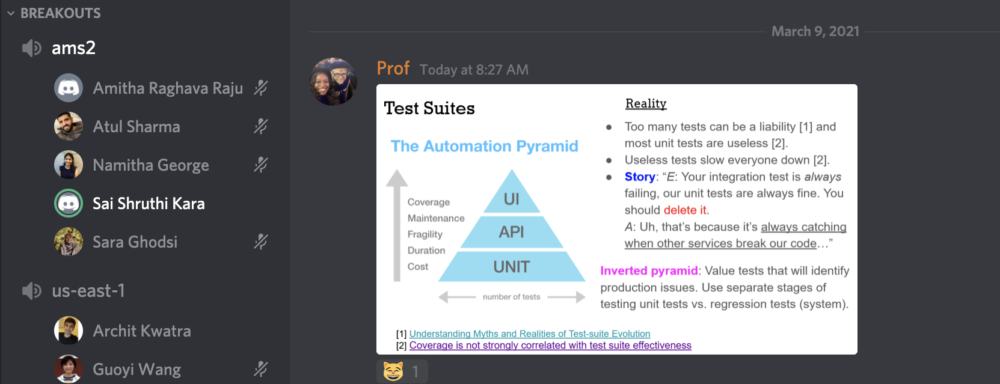
1.<b>What are some tradeoffs in having lots of unit tests and/or UI/integration tests in a CI pipeline?</b> 
  <p>We have discussed the following tradeoffs for lots of unit/UI/Integration tests as a part of our discussion:  </p>
  <ul>
    <li>When the testing happens , some of the tests might be unrelated to the features we might be testing, which is a wastefulness of resources. </li>
    <li>Having too many tests also, will lead to time consuming build process. </li>
   </ul>
     
 2. <b>What are some reasons why 100% test coverage (i.e. statement coverage), might be difficult, impossible, impractical, or even counter-productive to achieve in practice.</b><br/>
 Ans.) Some of the reasons we discussed are:<br/>
 <ul>
  <li>In order to achieve 100% test coverage, people can come up with useless test cases leading to wastage of time and resources.</li>
  <li>100% test coverage doesn't mean that they are no bugs. This might trick the testers and push them into illusion that all the scenarios are covered. This is counter-productive.</li>
  </ul>


# Conceptual Questions (42)
<ol>
  <li><b>What are the two different senses of testing and how do they differ?</b><br/>
  Ans.) The two different senses of testing and their difference is as follows:
  <ul>    
    <li><b>Sense of Discovery:</b>This works with the motto of finding the bugs which may be code bugs,logic bugs,processing bugs etc. This is where edge case detection or white box testing comes into picture.</li>
    <li><b>Sense of Verification:</b>Through this idea, we verify whether the system is delivering what it promised to. Whether the feature is really working or not. This is where the unit testing,acceptance testing or the assertions are done.</li>    
  </ul></li>
                                                                               
 <li><b>What is the goal of code coverage?</b><br/>
  Ans.) The main goal of the code coverage is to run as many lines of code as possible so that we can decrease the possibility of finding a fault. It helps to find the bad, unused or unnecessary code. It plays a crucial role in assessing the performance of the tests and the quality of the software that is built.</li>
  
<li><b>Does condition coverage imply branch coverage? Why not?</b><br/>
 Ans.) Condition coverage does not imply branch covergae. To prove this, consider the following code snippet:
 
  ```
  int cal(int p,int q)
  {
    if(p==0 ||q==1)
    {
      p+=q;
    }
    else
    {
      p-=q;
    }
    return p+q;
  }
  ```
  
  <ins>Test Suites:</ins><br/>
  [p,q]=[0,0]<br/>
  [p,q]=[1,1]<br/>
  
  When the conditions satisfy, we always move towards the branch with True condition leaving out the branch which is chosen when the conditions fail. The test suites performing 100% condition coverage does not result in 100% branch coverage.</li>
  
<li><b>Why might be data-flow coverage be a more effective criteria for testing than achieving path coverage?</b></br/>
  Ans.) Data flow coverage mostly concentrates on the assignments of the variables and the their computational use. It kind of narrows down our evaluation to a smaller subset of paths which shows us how the assignments change the values of variables or any other goal we want to pursue rather than covering every possible path( which might not actually be useful) as in the path coverage. </li>
  
<li><b>What is the primary limitation of mutation coverage?</b><br/>
 Ans.) Some of the limitations of the mutation coverage are:
  <ul>
    <li> The code base might be huge and testing the mutant programs against the original one might be complex.</li>
    <li> This type of coverage is very expensive and time consuming.</li>
  </ul>
  </li>

<li><b>How can an acceptance test be automated while still allowing human review?</b><br/>
Ans.) Whenever we make change and run the tests, we can also record a short video of the output resulting from that change through automation tools like selenium etc. And then the human can review to see if that is the expected outcome and sign off. This is very important in gaming environment where the automated tests might pass by pixel matching or other techniques. But, certain features, characteristics in a game can only be assessed by a human. So, in this way we can ensure that the acceptance testing is automated while still adding a human touch.
  </li>
<li><b>Why might the failure rate of a test be useful to know when analyzing a test suite?</b><br/>
Ans.)It is very important to know the failure rate because:<br/>
<ul>
  <li> Based on the consistency of the failure, we can get an insight about the flakyness of the test suite.</li>
   <li> It helps to analyse the code quality.  </li>
   <li> It is very useful to know the severity of the existing bugs in the code. </li> 
</ul>
</li>
<li><b>What's the highest level of flakyness a test can achieve and why? Hint: Think what behavior are purely random decision would be?</b><br/>
Ans.) We can calculate the flakyness score by Min(passing,failing)/(passing+failing).Let's say we are running a test case for 10 iterations. Consider the following scenarios:<br/>
  
|Pass|Fail|Score|
|----|----|----|
|10|0|0|
|0|10|0|
|6|4|0.4|
|5|5|0.5|
|8|2|0.2|

The pure randomness comes from the very fact that the test can fail or pass with equal probability how many ever iterations we might run. That is when when half of the times it passes and the other half, it fails. Hence, the highest level of flakyness a test can achieve is 50%(score of 0.5) .</li>

<li><b>What is the difference between generative and mutation-based fuzzing techniques?</b><br/>
Ans.)
  
| Generative   | Mutation-Based |
| ------------- | ------------- |
| We randomly create the input | We randomly modify the input |
| This is fairly complex as we need to determine the input format involving grammar etc.  | This is easy compared to generative fuzzing as we use the existing templates which are ready to be used |
|Produce higher quality test cases as it works with valid inputs| It might not always produce vaild mutants due to the chance of inputs being invalid as the input formats are not considered|
|Used for security testing| Suitable for vulnerability detection |

</li>
<li><b>Why might minification of fuzzing inputs be useful for debugging an fault?</b><br/>
Ans.) Sometimes input might be huge and we might be searching through it for a fault, but we will not be able to trace it down with such an input. To solve this issue, minification will be very useful, as it reduces the input to its minimal form such that the fault is still reproducible.</li>

<li><b>Why regex isn't enough for performing static analysis?</b><br/>
Ans.)While regex may work with small set of strings etc., but coming to the analysis of large and complex applications, regex is not the choice. The following are few problems with regex:<br/>
<ul>
  <li>Regex might be confusing, hard to read and difficult to maintain.</li>
  <li> There is a high chance of obtaining false positives and false negatives with regex.</li>
</ul>
Considering these issues, we might need something more than a regex for static analysis.
  </li>
<li><b>When implementing a code smell detector, how might you detect duplicated code?</b><br/>
Ans.) The following are few ideas for detecting duplicated code through a code smell detector:<br/>
<ul>
  <li>We can assess by passing random inputs to the code snippets and test if we are getting the same outcome everytime. If that is the case, then we can say that the code might be duplicated somewhere.</li>
  <li> We can split the text into tokens and count the number of times certain tokens are being repeated or do it efficiently using suffix tree etc.</li>
  <li>Using machine learning models like Support Vector Machines to parse and compare for similarity.</li>
</ul>
  </li>
<li><b>Why is an visitor pattern using technique for writing static analysis based code checks?</b><br/>
Ans.) Vistor pattern technique is useful because:<br/>
<ul>
<li>It helps us to navigate through the complex data structures without actually knowing the inner details or internal representation.</li>
<li>It is very useful to detect how long a function takes to run etc. by enabling us to subscribe and listen to the methods.</li>
</ul>
 </li>
<li><b>How might advanced analysis techniques such as statistical analysis or automated program repair impact the design and usage of an automated software pipeline?</b><br/>
Ans.)The system can fix the code that causes the test suites to fail through quick fix suggestions provided by the advanced techniques like statistical analysis or automated program repair with a very little or no human intervention. In this way, the pipeline progress will not be hindered by any failure, making the automation seamless.
  </li>
</ol>

# Coverage Calculation (10)<br/><br/>
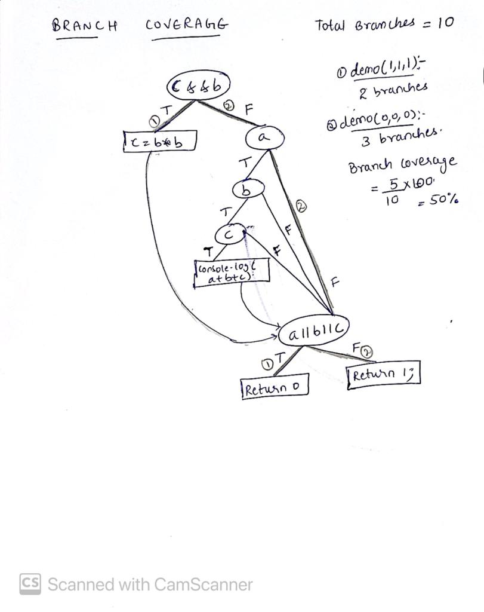<br/>

In total 5 branches are covered with the two test suites. Hence, 50% branch coverage is obtained.<br/><br/>
# Workshops (30)<br/><br/>
## Coverage Workshop

**Quiz**<br/><br/>
<br/><br/>

**Practice: Statement and Branch Coverage**<br/><br/>
<br/><br/>
<br/><br/>
**Coverage Report**<br/><br/>
<br/><br/><br/>
**Advanced Code Coverage**<br/><br/>
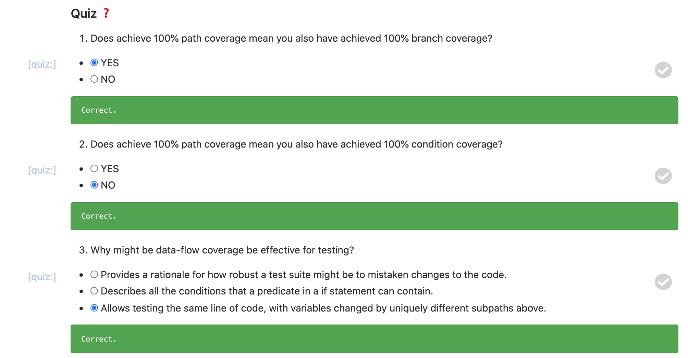<br/><br/><br/>

## Test Suites workshop
**Tasks**<br/>
**1. Simple test case analysis:**<br/><br/>
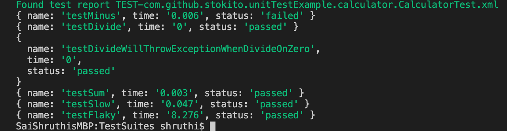<br/><br/>

**Calculating the flaky score?**<br/><br/>
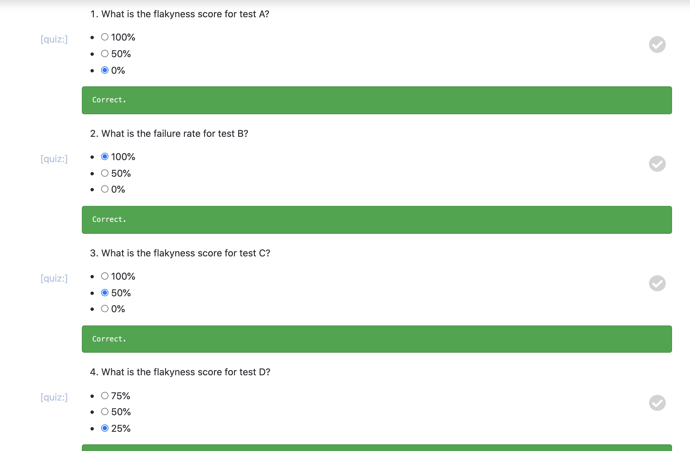<br/><br/><br/>
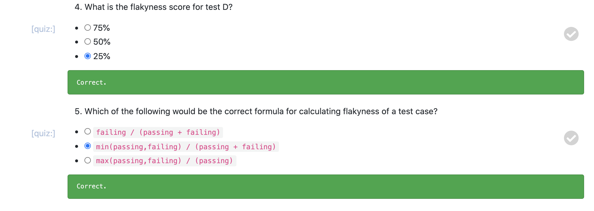<br/><br/><br/>

**2. Flaky test detection:(20 runs)**<br/><br/>
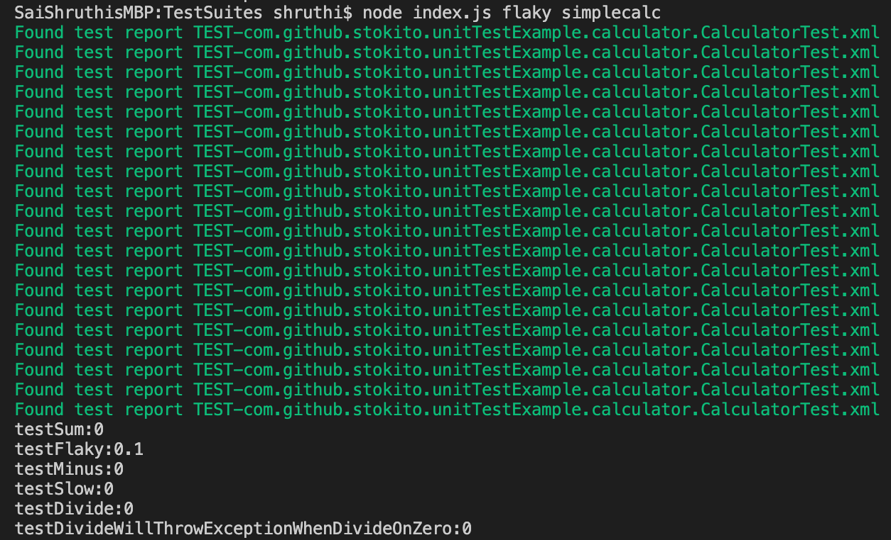<br/>

We can see that the test case - "testFlaky" is the flaky one with score of 0.1.<br/><br/>

## Fuzzing Workshop

**Fuzzing Seed Inputs**

1. **With 25% chance, remove a random set of characters, using array.splice from a random start position.**<br/>
Ans.) Yes, there are 5 faults and 46 exceptions after removing random set of characters as in the screenshot:
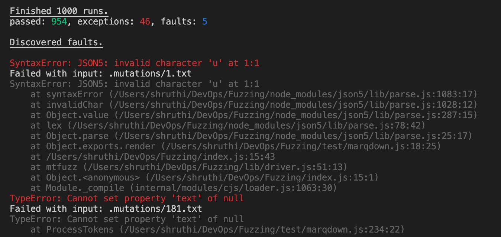<br/><br/>
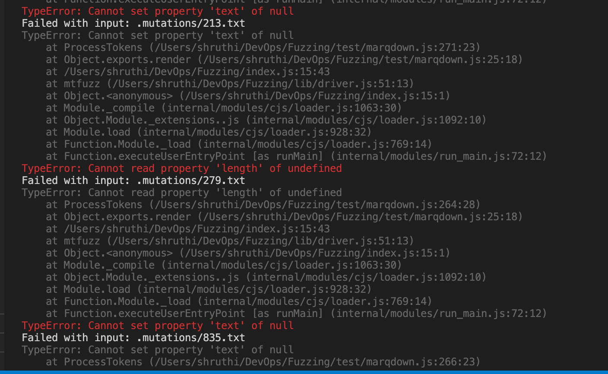<br/><br/>

2. **With a 25% chance, insert random characters into the string.**<br/>
Ans.) There are no new faults but the faults are decreased by 2 and the exceptions have increased after inserting random set of characters as in the screenshot:<br/>
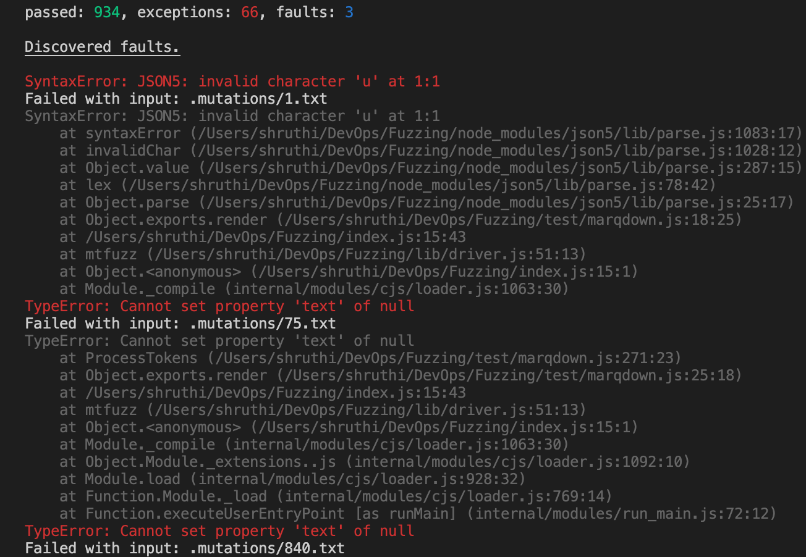<br/><br/>

3. **With a 50% chance, replace any single quote strings with a random integer.**<br/>
Ans.) When compared to the last task, there is one new fault( but it is one of the first 5 faults we have encountered as a part of task 1) and the exceptions are increasing after replacing any single quote strings with a random integer:<br/>
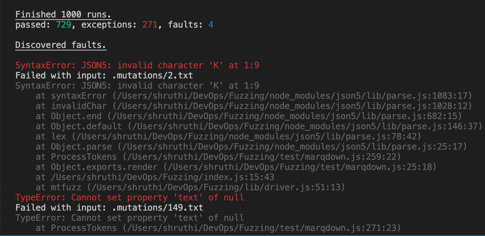<br/><br/>
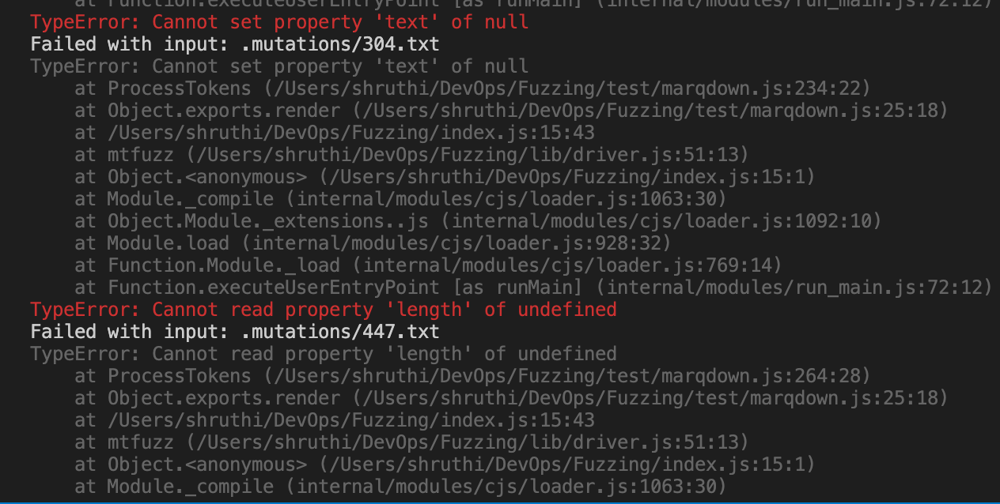<br/><br/>

4. **With a 25% chance, steps 1 and 2 (add a do/while loop).**<br/>
Ans.) When compared to the last task, there are no new faults- the faults are decreased by 2 as well as the exceptions after running do/while loop.<br/>
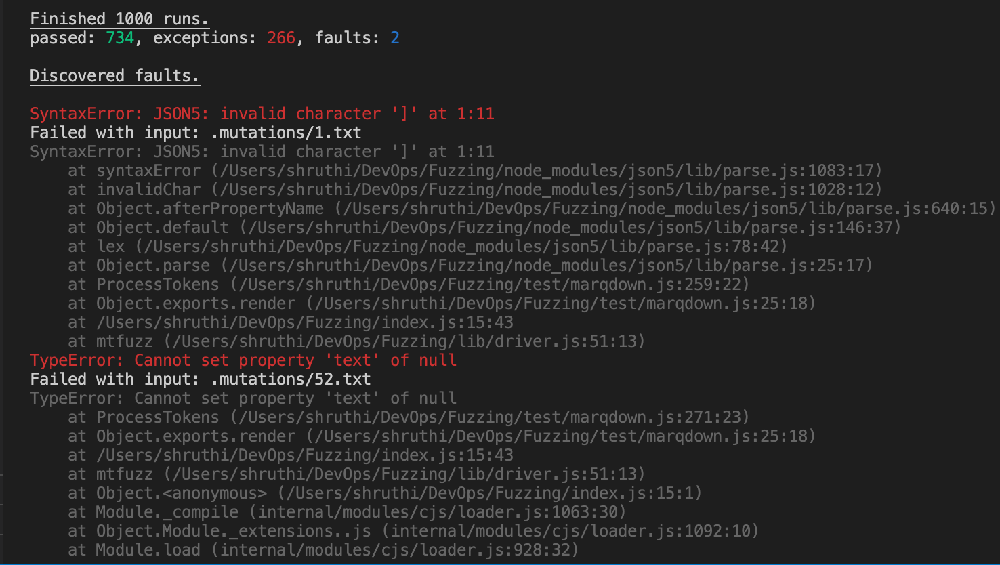<br/><br/>

**Experiments**
1. **Adding array.reverse().Do you think this will make the code find more faults or less? Why?**<br/>
Ans.) Reversing the array has resulted in only one fault and with a thousand exceptions as in the screenshot:<br/>
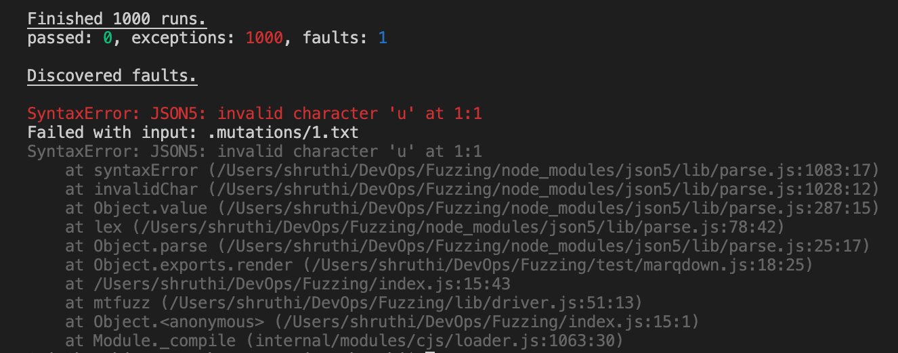<br/><br/>
Generally we start and end the markdown files with some sort of tags etc. The reversal will not help reveal more faults because, when we reverse the text, invalid ordering of these symbol will take place(for example,{ or > etc)  and we will always be stuck with the invalid character error specifically at the first position of the line and cannot test beyond that.

2. **Increase the number of iterations run from 1000 to 15000. Did you find any new faults? Try with an even larger number, 100000. Did that make a difference? Why do you think changing the number of runs might help reveal more faults (or not)?**<br/>
Ans.) Increasing the number of runs added new faults as well as resulted in spike of the exceptions:<br/>
<ins>15000 Runs:</ins><br/>
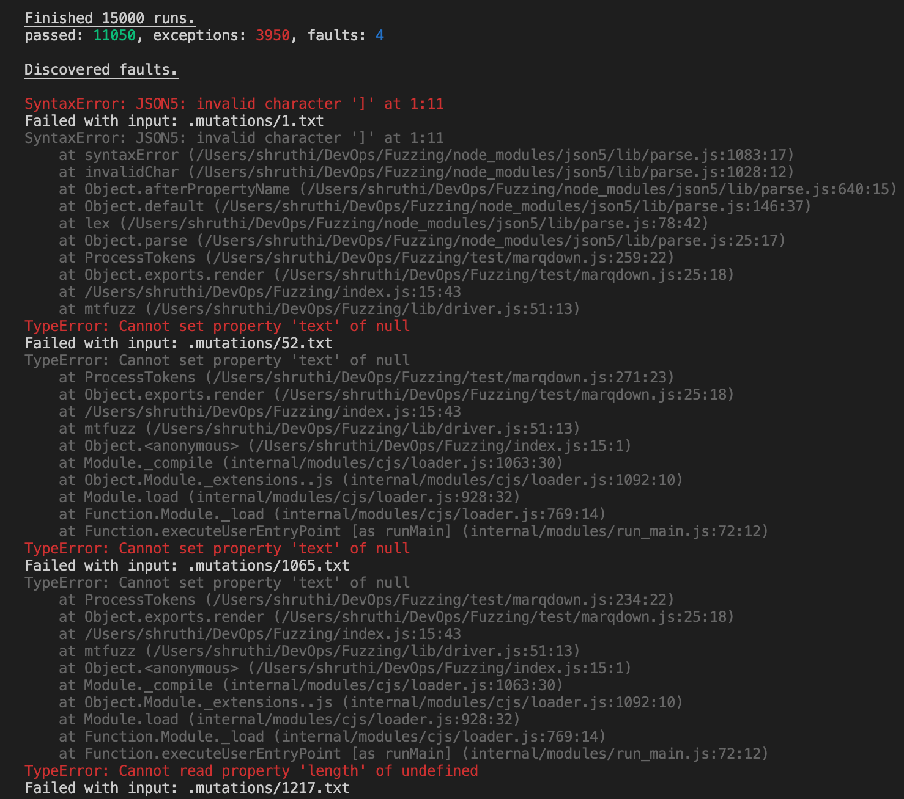<br/><br/>
<ins>100000 Runs:</ins><br/>
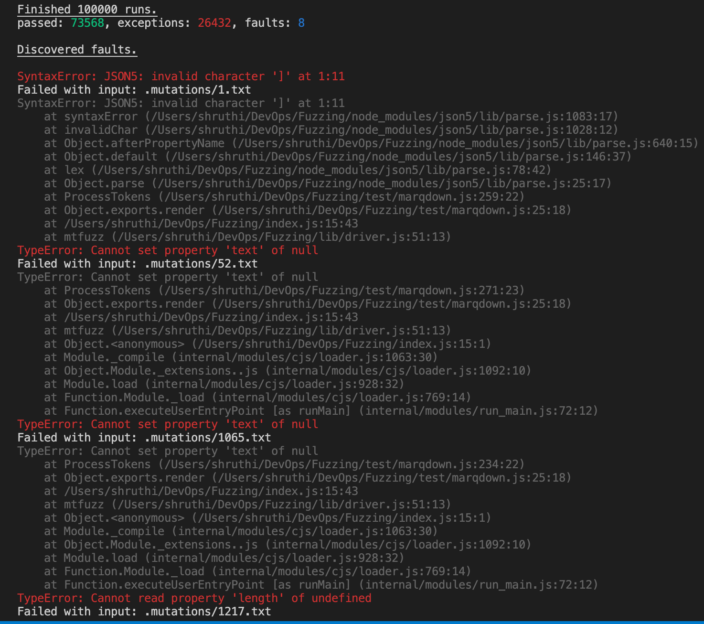<br/><br/>
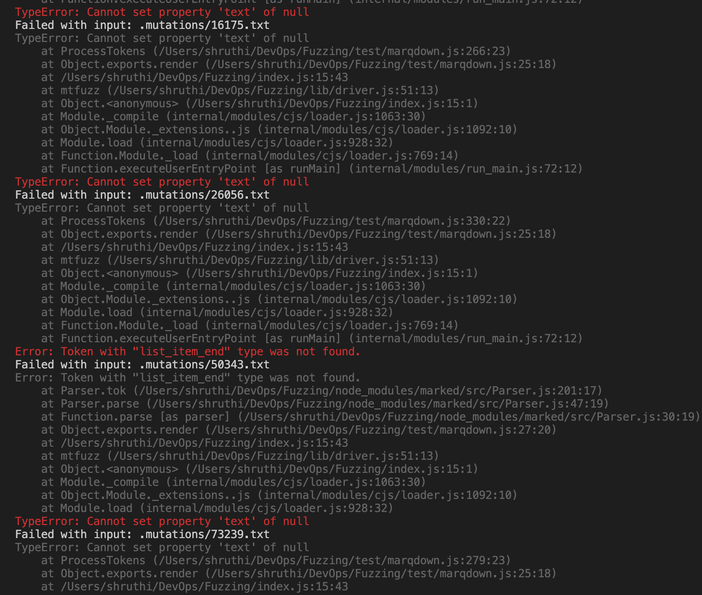<br/><br/>
Changing the number of runs might help reveal more faults because the probability of picking both the mardown files will be maximized ( which might be little biased towards a particular file in case of few runs). Also, since the input markdown files will be tested rigourously with inserting ,replacing and removing random characters, there is a high chance that we might find more faults.<br/>
