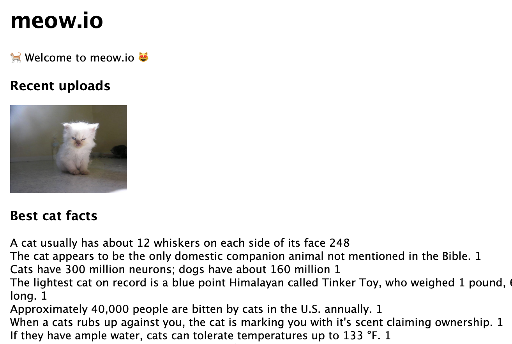

<!--
targets:
    - type: bakerx
      name: meow.io
-->

## Using caches and queues in meow.io

Part 1. [Setup and Overview](README.md)    
Part 2. [Using express and redis](Basics.md)     
Part 3. [Using caches and queues in meow.io](Meow.md) ⬅️   

In this part of the workshop, we'll be running commands inside the meow.io server.

### Setup

Let's get the meow.io code base.

``` bash | {type: 'command', failed_when: 'exitCode!=0'}
git clone https://github.com/CSC-DevOps/meow.io
```

To edit the meow.io files, it is recommended you install the Visual Studio Remote-SSH extension, which will allow you to directly edit the files on the VM from Visual Studio. You could of course, just use vim... 😈

https://code.visualstudio.com/docs/remote/ssh

### Meow.io

Now that you have a better handle on using express and redis, let's see if we do tasks on a simple app, meow.io.
This is a simple 3-tier node.js application, with a view, app layer, and database.



To run the application, perform the following steps:

```bash
# Setup app
cd meow.io
npm install 
node data/init.js

# Start server
npm start
```

```bash | {type: 'terminal', 'background-color': '#7e050d'}
```


You should be able to visit http://192.168.44.81:3000/

##### Task 3: Cache best facts calculation

The front page will load all cat facts and display the 100 most voted facts on each page load. Without caching, this can add up with heavier traffic.

```bash | {type: 'command'}
time ./meow.io/load-index.sh 
```

However, if we cache the results, we can greatly reduce the lag by at least 10x.

```bash
real	2m01.373s # (Without caching)
real	0m20.373s # (With caching)
```

🏗️ Task: Modify `meow.io/routes/index.js` to cache and return the results of bestFacts. Have cached results expire after 10 seconds. You should see a reduction in load time for the site. 

**Note:** This is making an explicit trade-off between availability and consistency, since displayed data will be potentially 10 seconds behind real scores.

##### Task 4: Cat picture uploads storage
 
The front page will display the 5 most recently uploaded files using the `/upload` route. You can use curl to help you upload files easily for test.

```bash | {type: 'command'}
curl -F "image=@./meow.io/data/morning.jpg" http://localhost:3000/upload
curl -F "image=@./meow.io/data/i-scream.jpg" http://localhost:3000/upload
curl -F "image=@./meow.io/data/hairypotter.jpg" http://localhost:3000/upload
```

However, these images are being read from the database on each page load. You could instead simply change the code to both write to the database *and* store the 5 most recently uploaded files in redis. Then the recentUploads call can read from the redis store instead of the db.

🏗️ Task: Modify the `meow.io/routes/upload.js` file to cache recently uploaded images in addition to writing to the database. Modify the `meow.io/routes/index.js` to read from the cache instead the database.

Consider using [`LPUSH`](https://redis.io/commands/lpush), [`LTRIM`](https://redis.io/commands/ltrim), and[`LRANGE`](https://redis.io/commands/lrange) redis commands to store the 5 most recent uploaded images.

📊 Using `time ./meow.io/load-and-vote-upload.sh`, compare before and after performance differences.

##### Task 5: Regulate uploads with queue

meow.io is a huge success. You are now receiving a large volume of uploads, much faster than your poor database can handle.

🏗️ Task: Modify the `meow.io/routes/upload.js` to store incoming images in a queue and not the database. Modify `meow.io/app.js` to timer (setInternal every 100ms), to pop images stored in the queue (consider using  [`LPOP`](https://redis.io/commands/lpop) ) and save in the database. This way, you can take advantage of the faster write speed for redis and drain the queue at a steady rate for longer term storage.

📊 Using `time ./meow.io/load-and-vote-upload.sh`, compare before and after performance differences.

```bash | {type: 'terminal', 'background-color': '#7e050d'}
```