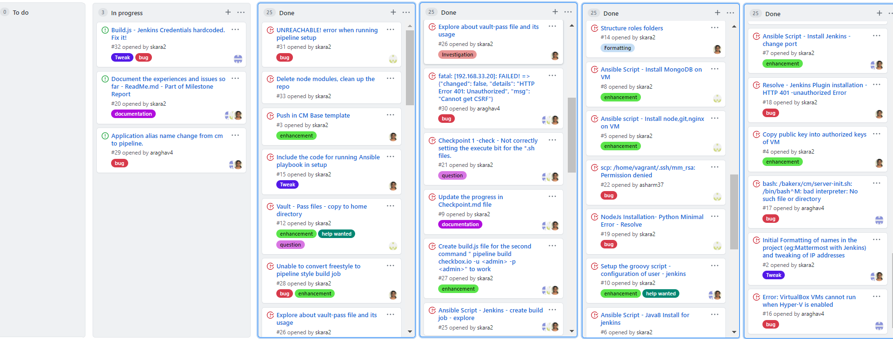

<h1>Milestone 1 - Checkpoint Report</h1>

# Checkpoint 1
  
[Opunit Checks](https://github.ncsu.edu/cscdevops-spring2021/DEVOPS-22/issues/11)  

-------------
## Completed Tasks
We have worked on the following tasks for this checkpoint: 

**Intial tasks:- Amitha & Shruthi** 
<ul>
  <li>Intial pipeline setup - formatting</li>
  <li>Copy insecure private key onto the configuration server.</li>
  <li>Ansible roles - folder structure creation</li>
  <li>Fixing the playbook.js,inventory.ini,playbook.yml - for the first ping to the server to work.</li>
</ul>

**Automatically configure a jenkins server- Amitha & Shruthi** 
<ul>
  <li>Creation of Ansible java8 - script</li>
  <li>Setting the vars appropriate for the jenkins script</li>
  <li>Creation of groovy script- inclusion onto the jenkins script</li>
  <li>Jenkins script completed - works and displays the login page</li>
</ul>

**Automatically configure a build environment (checkbox.io) - Atul**
<ul>
  <li>Ansible scripts - Nodejs, Git, Nginx</li>
  <li>Ansible script - MongoDB</li>
  <li>Ansible script - Checkpoint.io - Assembling</li>
</ul>

-----------------------
# Tasks to be completed
<ul>
  <li>Create a build job for jenkins</li>
   <li>Working with the Vault pass file</li>
   <li>Milestone Report creation</li>
  <li>Code checkin - completely onto Master</li>
  <li>Screencast of the work</li>
</ul>

------------------
# Checkpoint 2
  

## Completed Tasks
We have completed the to-do tasks mentioned in checkpoint1.

We have worked on the following tasks for this checkpoint: 

**Create a build job for Jenkins**
<ul>
  <li>Create ansible script [cm\roles\create_jobs\templates\checkbox_jenkins_jobs.yml] - pipeline style build job - <b>Atul</b></li>
  <li>Get the second command running - create build.js file - <b>Amitha</b></li>
  <li>Create the ansible-vault-pass file and pass it to Ansible playbook which is used for encryption of confidential files - vars.yml, jenkins_job.ini (Jenkins configuration file) - <b>Shruthi</b>.</li>
</ul>

-----------------------

## Combined efforts :
* Completed Milestone1 Report
* Fixed assigned respective bugs
* Completed Screencast
